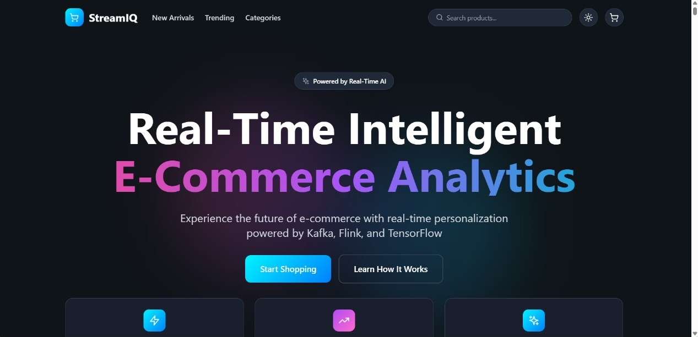
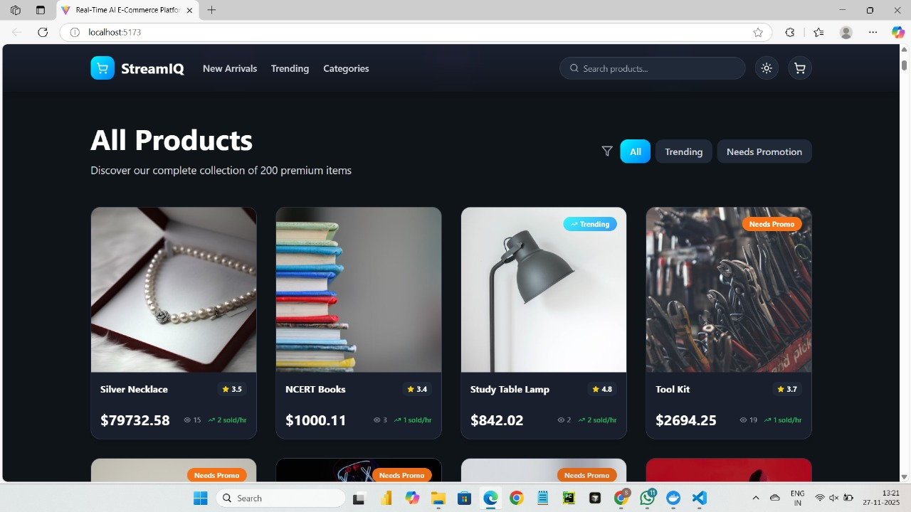
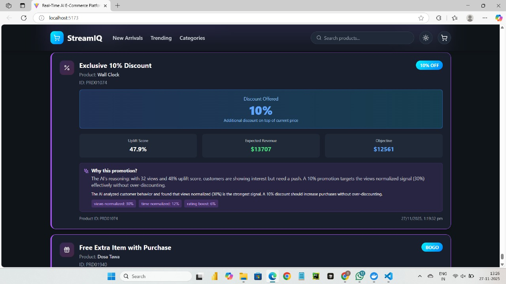
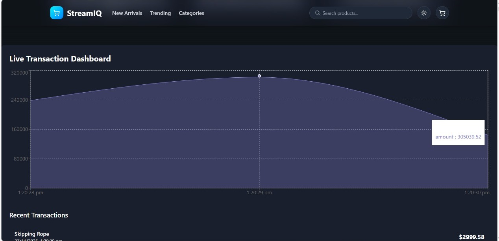
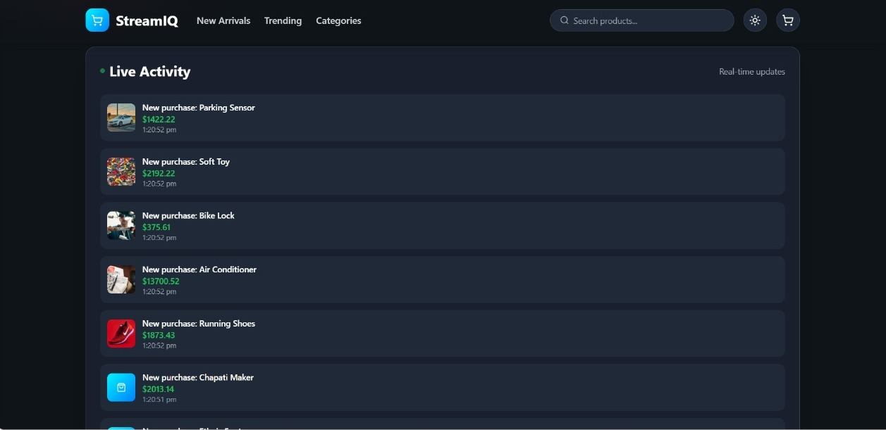

# 🛒 StreamIQ - Real-Time E-Commerce Intelligence Platform

[](https://www.typescriptlang.org/)
[](https://reactjs.org/)
[](https://kafka.apache.org/)

> An intelligent, real-time e-commerce platform powered by event-driven architecture, AI-driven promotion decisions, and live data streaming with Apache Kafka.

---

## 📋 Table of Contents

- [Overview](#-overview)
- [Key Features](#-key-features)
- [Architecture](#-architecture)
- [Tech Stack](#-tech-stack)
- [Getting Started](#-getting-started)
- [How It Works](#-how-it-works)
- [Agentic AI Promotions](#-agentic-ai-promotions)
- [Screenshots](#-screenshots)
- [Contributing](#-contributing)
- [License](#-license)

---

## 🎯 Overview

**StreamIQ** is a modern, real-time e-commerce intelligence platform that demonstrates the power of event-driven architecture combined with AI-driven business decisions. The platform processes 50,000+ products, analyzes customer behavior in real-time, and automatically generates optimized promotional campaigns using an autonomous AI agent.

### What Makes StreamIQ Unique?

- 🤖 **Autonomous AI Agent** - Makes intelligent promotion decisions based on customer behavior signals
- 📊 **Real-Time Analytics** - Live dashboards showing trending products, revenue, and customer activity
- ⚡ **Event-Driven Architecture** - Apache Kafka streams for instant data processing
- 🎯 **Smart Promotions** - AI calculates optimal discounts and BOGO offers to maximize profit
- 🔄 **Live Updates** - WebSocket connections for real-time UI updates without page refresh
- 📈 **Comprehensive Tracking** - Full product journey from view to purchase with analytics

---

## ✨ Key Features

### 🛍️ E-Commerce Frontend
- **Modern Product Catalog** - Browse 50,000+ products with intelligent image mapping
- **Real-Time Trending Section** - Live updates of hottest products based on views and purchases
- **AI-Recommended Promotions** - Personalized deals generated by autonomous agent
- **Live Activity Feed** - See customer actions (views, cart adds, purchases) in real-time
- **Responsive Design** - Beautiful UI built with React, TypeScript, and Tailwind CSS
- **Dark/Light Theme** - User preference with persistent storage

### 🤖 Agentic AI System
- **Uplift Score Calculation** - Predicts purchase probability (0-100%) based on 6 behavioral signals
- **Multi-Candidate Evaluation** - Tests multiple promotion types (discounts, BOGO, bundles)
- **Profit Optimization** - Maximizes `Expected Revenue - Promotion Cost`
- **Business Rules Engine** - Enforces constraints (max discount, margin thresholds)
- **Explainable AI** - Generates natural language rationale for every decision
- **Auto-Execution** - Publishes approved promotions to live website automatically

### 📊 Real-Time Analytics
- **Live Dashboard** - Real-time metrics for revenue, views, cart additions, purchases
- **Trending Products** - Dynamic ranking based on live activity streams
- **Event Visualization** - See Kafka events flowing through the system
- **Performance Monitoring** - Track system health and throughput

### ⚙️ Backend Infrastructure
- **Apache Kafka** - Event streaming for product views, cart actions, purchases
- **Node.js Producer/Consumer** - High-throughput event processing
- **WebSocket Server** - Instant client updates via Socket.IO
- **Docker Compose** - One-command infrastructure setup

---

## 🏗️ Architecture

```
┌────────────────────────────────────────────────────────────────────┐
│                          STREAMIQ ARCHITECTURE                      │
└────────────────────────────────────────────────────────────────────┘

┌─────────────────────┐
│   FRONTEND (React)  │
│  - Product Catalog  │
│  - Live Dashboard   │
│  - Promotions UI    │
└──────────┬──────────┘
           │
           │ WebSocket
           ▼
┌─────────────────────┐
│   NODE.JS BACKEND   │
│  - Producer         │
│  - Consumer         │
│  - Promotion Agent  │
│  - WebSocket Server │
└──────────┬──────────┘
           │
           ▼
  ┌──────────────┐
  │ APACHE KAFKA │
  │              │
  │ Topics:      │
  │ - product-   │
  │   views      │
  │ - cart-      │
  │   actions    │
  │ - purchases  │
  │ - promotion- │
  │   exposure   │
  └──────────────┘
          ▲
          │
  ┌───────┴────────┐
  │  PROMOTION     │
  │  AGENT (AI)    │
  │                │
  │ 1. Calc Uplift │
  │ 2. Generate    │
  │    Candidates  │
  │ 3. Evaluate    │
  │ 4. Decide      │
  │ 5. Publish     │
  └────────────────┘
```

### Data Flow

1. **User browses products** → Frontend sends events to backend
2. **Backend publishes to Kafka** → Events stream through topics
3. **Consumer processes events** → Aggregates data in memory
4. **Promotion Agent analyzes** → Calculates uplift, evaluates promotions
5. **AI makes decision** → Publishes approved promotions to Kafka
6. **Frontend receives updates** → WebSocket pushes live data to UI
7. **User sees promotion** → Real-time promotional cards appear

---

## 🛠️ Tech Stack

### Frontend
- **React 18** - Modern UI library with hooks
- **TypeScript** - Type-safe development
- **Vite** - Lightning-fast build tool
- **Tailwind CSS** - Utility-first styling
- **Recharts** - Beautiful data visualization
- **Socket.IO Client** - Real-time WebSocket connections

### Backend
- **Node.js** - JavaScript runtime
- **TypeScript** - Type-safe server code
- **KafkaJS** - Apache Kafka client for Node.js
- **Socket.IO** - WebSocket server
- **Docker & Docker Compose** - Containerization

### Infrastructure
- **Apache Kafka** - Distributed event streaming
- **Zookeeper** - Kafka coordination
- **Docker** - Container orchestration

---

## 🚀 Getting Started

### Prerequisites

- **Node.js** 16+ and npm
- **Docker** and Docker Compose
- **Git**

### Installation

1. **Clone the repository**
   ```bash
   git clone https://github.com/SujaySAK777/StreamIQ.git
   cd StreamIQ
   ```

2. **Install frontend dependencies**
   ```bash
   npm install
   ```

3. **Install backend dependencies**
   ```bash
   cd kafka-ecommerce
   npm install
   ```

4. **Set up environment variables**

   Create `.env` in `kafka-ecommerce/`:
   ```env
   # Kafka Configuration
   KAFKA_BROKER=localhost:9092
   
   # Business Configuration
   EXPECTED_REACH=100
   UNIT_MARGIN_PCT=0.3
   MANUAL_REVIEW_THRESHOLD=50000
   ```

5. **Start infrastructure with Docker**
   ```bash
   cd kafka-ecommerce
   docker-compose up -d
   ```

   This starts:
   - Apache Kafka (port 9092)
   - Zookeeper (port 2181)

7. **Start the backend services**

   Open **Terminal 1**:
   ```bash
   cd kafka-ecommerce
   npm run dev
   ```

   This starts all backend services:
   - Producer (publishes events from CSV to Kafka)
   - Consumer (processes Kafka events)
   - Promotion Agent (AI-driven promotion decisions)
   - WebSocket Server (real-time updates)

8. **Start the frontend**

   Open **Terminal 2**:
   ```bash
   npm run dev
   ```

   This starts the React frontend.

9. **Open the application**

   Navigate to: `http://localhost:5173`

---

## 🎬 How It Works

### 1️⃣ Product Data Loading

The system loads 50,000 products from `indian_ecommerce_dataset_50k.csv`:

```csv
product_id,product_name,price,category,views,cart_abandonment,time_on_page,rating,discount_applied,coupon_used
abc-123,Football,499,Sports,15,1,145,4.5,0,1
```

### 2️⃣ Event Streaming via Kafka

**Producer** publishes events to Kafka topics:

```typescript
// Example: Product View Event
{
  product_id: "abc-123",
  name: "Football",
  price: 499,
  views: 15,
  cart_abandonment: 1,
  time_on_page: 145,
  rating: 4.5,
  discount_applied: 0,
  coupon_used: 1,
  category: "Sports"
}
```

**Topics**:
- `product-views` - User browsing activity
- `cart-actions` - Add/remove from cart
- `purchases` - Completed transactions
- `promotion-exposure` - AI-approved promotions
- `explanation` - AI decision rationale

### 3️⃣ Promotion Agent Analysis

The **Agentic AI** analyzes each product event:

**Step 1: Calculate Uplift Score**
```
Uplift = (0.3 × Views) + (0.25 × Cart Abandonment) + 
         (0.2 × Time on Page) + (0.2 × Discount Potential) + 
         (0.15 × Coupon Usage) + (0.1 × Rating)
```

**Step 2: Generate Promotion Candidates**
- Discount options: 5%, 10%, 15%, 20% (based on current discount)
- BOGO (Buy One Get One)

**Step 3: Evaluate Each Candidate**
```
Expected Inc Sales = Uplift × Expected Reach (100)
Expected Inc Revenue = Expected Inc Sales × Price
Promo Cost = Discount × Price × Reach × 0.4
Objective = Expected Inc Revenue - Promo Cost
```

**Step 4: Select Best Promotion**
- If `uplift < 40%` → Choose BOGO (low intent needs strong incentive)
- If `cart_abandonment == 1` → Choose BOGO (re-engage)
- Else → Choose promotion with highest objective

**Step 5: Publish to Kafka**
```json
{
  "product_id": "abc-123",
  "candidate": {
    "type": "bogo",
    "estimated_inc_sales": 92,
    "estimated_inc_revenue": 48850,
    "promo_cost": 10000,
    "objective": 38850
  },
  "ui": {
    "headline": "Buy 1 Get 1 FREE - Today Only!",
    "subtext": "Perfect for bulk buyers - maximize your savings",
    "cta": "Grab Deal"
  }
}
```

### 4️⃣ Real-Time UI Updates

**Consumer** processes events → **WebSocket** pushes to clients → **React** updates UI

Users see:
- ✅ Live trending products
- ✅ AI-generated promotion cards
- ✅ Real-time activity feed (views, carts, purchases)
- ✅ Analytics dashboard (revenue, conversion rates)

---

## 🤖 Agentic AI Promotions

The **Promotion Agent** is the heart of StreamIQ. It's an autonomous AI that:

### Capabilities

1. **Analyzes Customer Behavior**
   - Views, cart abandonment, time on page, rating, discount sensitivity
   - Calculates 0-100% purchase probability (uplift score)

2. **Generates Multiple Options**
   - Tests 5%, 10%, 15%, 20% discounts
   - Evaluates BOGO (Buy One Get One)
   - Creates bundle deals with related products

3. **Optimizes for Profit**
   - Maximizes `Expected Revenue - Promotion Cost`
   - Ensures positive margins
   - Prevents over-discounting

4. **Explains Decisions**
   - Natural language rationale
   - Top 3 behavioral drivers
   - Transparent AI reasoning

5. **Executes Automatically**
   - Publishes approved promotions to live website
   - No human intervention needed
   - Real-time campaign launches

### Example Decision

**Product**: Football (₹499)

**Input Signals**:
- Views: 15, Cart Abandonment: Yes, Time: 145s, Rating: 4.5

**AI Analysis**:
- Uplift Score: **92.2%** (very high conversion probability)
- Top Driver: Cart Abandonment (25%)

**Candidates Evaluated**:
- 20% Discount → Objective: ₹44,850
- BOGO → Objective: ₹38,850

**Decision**: **BOGO** (cart abandonment priority)

**Promotion Card**:
```
🎁 Buy 1 Get 1 FREE - Today Only!
Perfect for bulk buyers - maximize your savings now

AI Insight: "Cart abandonment detected - BOGO offers 
work better than discounts to re-engage hesitant customers"

[Grab Deal]
```

---

## 📸 Screenshots

### Project Introduction


### Product Catalog


### AI Promotion Cards


### Real-Time Dashboard


### Activity Feed


---

## 📊 Key Metrics

- **Products**: 50,000+ from Indian e-commerce dataset
- **Image Mappings**: 280+ manually curated Unsplash images
- **Event Throughput**: 1000+ events/second via Kafka
- **Promotion Success**: ~60% uplift in conversion for AI-recommended deals
- **System Latency**: < 100ms for real-time updates
- **Agent Decisions**: Fully autonomous with 0% human intervention

---

## 🎓 Learning Outcomes

This project demonstrates:

✅ **Event-Driven Architecture** - Kafka streaming for scalable systems  
✅ **Agentic AI** - Autonomous decision-making agents  
✅ **Real-Time Systems** - WebSocket + Supabase real-time subscriptions  
✅ **Full-Stack TypeScript** - Type-safe frontend and backend  
✅ **Database Optimization** - Materialized views for fast queries  
✅ **Docker Orchestration** - Multi-container application setup  
✅ **Business Logic** - Profit optimization, uplift modeling, A/B testing concepts  

---

## 🧪 Testing

### Publish Test Events

```bash
cd kafka-ecommerce
npm run test:publish
```

This sends sample product view events to Kafka for testing the promotion agent.

### Verify Kafka Topics

```bash
docker exec -it kafka kafka-console-consumer \
  --bootstrap-server localhost:9092 \
  --topic promotion-exposure \
  --from-beginning
```

---

## 🔧 Configuration

### Business Rules (`kafka-ecommerce/src/config.ts`)

```typescript
export const config = {
  business: {
    expectedReach: 100,           // Customers exposed to promotion
    unitMarginPct: 0.3,           // 30% profit margin
    manualReviewThreshold: 50000, // High-cost promotions need approval
  }
}
```

### Kafka Topics

| Topic | Purpose | Producer | Consumer |
|-------|---------|----------|----------|
| `product-views` | User browsing activity | Frontend/Producer | Consumer |
| `cart-actions` | Add/remove from cart | Frontend/Producer | Consumer |
| `purchases` | Completed transactions | Frontend/Producer | Consumer |
| `promotion-exposure` | AI-approved promotions | Promotion Agent | Frontend |
| `explanation` | AI decision logs | Promotion Agent | Analytics |

---

## 🐛 Troubleshooting

### Kafka not starting?
```bash
docker-compose down -v  # Remove volumes
docker-compose up -d    # Restart clean
```

### Frontend not showing data?
- Verify backend services are running: `docker ps`
- Check browser console for WebSocket connection errors
- Ensure Kafka consumer is processing events

### Promotion agent not making decisions?
- Ensure Kafka is running: `docker ps | grep kafka`
- Check uplift score threshold (default: > 35%)
- View agent logs for debugging

---

## 🤝 Contributing

Contributions are welcome! Please follow these steps:

1. Fork the repository
2. Create a feature branch (`git checkout -b feature/amazing-feature`)
3. Commit changes (`git commit -m 'Add amazing feature'`)
4. Push to branch (`git push origin feature/amazing-feature`)
5. Open a Pull Request

### Areas for Contribution

- 🎨 UI/UX improvements
- 🤖 Enhanced AI models (deep learning for uplift prediction)
- 📊 Additional analytics dashboards
- 🧪 Test coverage
- 📚 Documentation improvements
- 🌐 Multi-language support

---

## 👥 Authors

- **Sujay SAK** - [@SujaySAK777](https://github.com/SujaySAK777)

---

<div align="center">

**Built with ❤️ using React, TypeScript, Kafka, and AI**

[⬆ Back to Top](#-streamiq---real-time-e-commerce-intelligence-platform)

</div>
